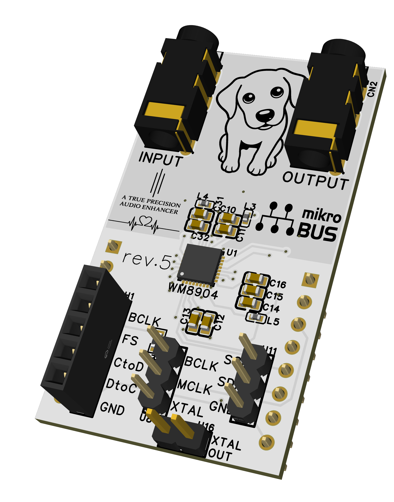
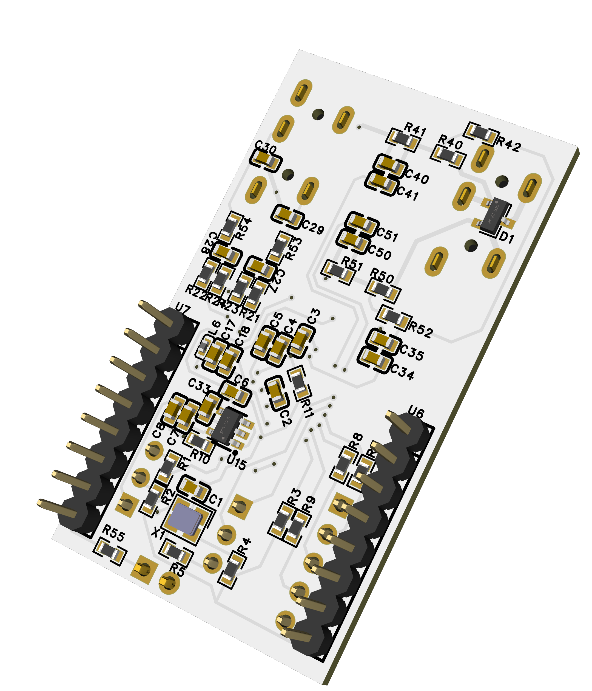

# WM8904 mikroBUS Audio Codec Board (EasyEDA)

  
  

<i>rev.5 &mdash; the latest design, built and verified on hardware. Front and back 3D views. 
rev.4, the previous revision: <a href="WM8904_mikroBUS_04/WM8904_mikroBUS_04_front.png">front</a> / <a href="WM8904_mikroBUS_04/WM8904_mikroBUS_04_back.png">back</a>.</i>

A stereo audio codec add-on board in the mikroBUS&trade; form factor, built
around the Cirrus Logic (Wolfson) **WM8904**: 3.5 mm LINE/MIC input and
headphone output jacks, I&sup2;C control, I&sup2;S/TDM audio, an on-board
crystal, and jumpers for the BCLK / MCLK / XTAL clock routing.

This repository holds the EasyEDA project files and the exported reference
documents (schematic PDF, front/back PCB images) for each revision.

日本語の説明は[このファイルの後半](#日本語)にあります。

## Revisions

### rev.04 &mdash; built, verified on hardware

- Added the microphone bias (MICBIAS) connection.
- **Known issue: Left and Right are swapped, on both the input and the output
  path.** The board is usable as-is, but the channel swap has to be undone in
  the WM8904 register configuration on the host side.

### rev.05 &mdash; built, verified on hardware

- Fixes the Left/Right swap of rev.04. Verified on hardware: the input and
  output channels now match the WM8904 register map, so the host-side swap that
  rev.04 needed is no longer required.
- Adds a jumper that drives the on-board XTAL clock out to the mikroBUS&trade;
  connector, so a host can be clocked from this board's crystal. Verified on
  hardware.
- **The clock output is on mikroBUS&trade; pin 2 (`XTAL_OUT`), not pin 1.** On
  some mainboards pin 1 is wired to an RGB LED, which is why the clock is
  brought out one pin over. The schematic carries the same note.

## Projects

| Directory | EasyEDA project | Status | Included reference outputs |
| --- | --- | --- | --- |
| `WM8904_mikroBUS_04` | `WM8904_mikroBUS_04.eprj` | Built, verified | Schematic PDF and front/back PCB PNG files |
| `WM8904_mikroBUS_05` | `WM8904_mikroBUS_05.eprj` | Built, verified | Schematic PDF and front/back PCB PNG files |

The project file in each directory is the editable EasyEDA source. The PDF and
PNG files are exported reference outputs for reviewing the schematic and PCB
without opening EasyEDA.

## mikroBUS&trade; Standard

mikroBUS&trade; was created by MikroElektronika and published as an open
standard: *"anyone can implement mikroBUS&trade; in their hardware design, as
long as the requirements set by this document are being met"*
([mikroBUS standard specifications v2.00](https://download.mikroe.com/documents/standards/mikrobus/mikrobus-standard-specification-v200.pdf),
June 2015, Introduction).

Two points of that specification are worth stating explicitly for anyone reusing
these designs:

- The specification **requires** the mikroBUS&trade; logo on an add-on board
  ("mikroBUS&trade; logo anywhere on the board, either front or back"), which is
  why it appears on the silkscreen here.
- `click board&trade;` is MikroElektronika's own brand of mikroBUS&trade; add-on
  boards. Third-party boards may not be called click boards&trade;, and the word
  "click" may not appear on the silkscreen. It does not appear anywhere in these
  designs.

These boards are not MikroElektronika products and are not endorsed by
MikroElektronika.

**Outline: these boards are larger than the prescribed add-on board sizes.** The
socket geometry is standard &mdash; the two 1x8 header rows are 22.86 mm apart,
exactly as specified &mdash; so the board plugs into any mikroBUS&trade; socket.
The board outline, however, matches none of the prescribed S/M/L sizes:

| | Width | Length |
| --- | --- | --- |
| Specification: S / M / L | 25.4 mm | 28.6 / 42.9 / 57.15 mm |
| rev.04 | 26.92 mm | 47.50 mm |
| rev.05 | 26.92 mm | 48.00 mm |

Both are 1.5 mm wider than standard, and their length falls between the M and L
sizes. Neither has the prescribed notch on the bottom-right corner. On a
mainboard with several adjacent sockets, or inside an enclosure, check the
clearance before assuming a fit.

## Opening A Project

Open or import the `.eprj` file with the EasyEDA edition used to create the
project. Keep the project file and its PDF/PNG exports together when sharing a
revision.

Both `.eprj` files descend from the same EasyEDA project, so they carry the same
internal project and document identifiers. Importing both into one EasyEDA
account may collide or overwrite; import them into separate accounts or
workspaces, or rename the project after the first import.

## License

The original material contributed to this repository is dedicated to the
public domain under [CC0 1.0 Universal](https://creativecommons.org/publicdomain/zero/1.0/).
The full legal text is in [LICENSE](LICENSE).

This dedication applies only to original material for which the contributor
holds the relevant rights. It does not apply to third-party component
libraries, datasheets, reference designs, trademarks, or other material owned
by its respective rights holders. CC0 does not grant patent or trademark
rights.

Silkscreen artwork: the dog line-art was generated from a photograph of the
author's own dog. The "A TRUE PRECISION AUDIO ENHANCER" wordmark was contributed
by a colleague of the author, with permission to use it and no rights asserted.

`mikroBUS` and `click board` are trademarks of MikroElektronika; `WM8904` and
`Wolfson` are marks of Cirrus Logic. They are used here only to identify the
socket standard and the codec part.

These are hobby/experimental designs published as a reference, with no warranty
of any kind, express or implied &mdash; including fitness for a particular
purpose. Anyone fabricating or using them does so at their own risk.

---

# 日本語

Cirrus Logic (Wolfson) **WM8904** を使った、mikroBUS&trade; 形状のステレオ
オーディオコーデック アドオンボードです。3.5 mm の LINE/MIC 入力とヘッドホン
出力ジャック、I&sup2;C 制御、I&sup2;S/TDM オーディオ、基板上の水晶、および
BCLK / MCLK / XTAL のクロック経路を選ぶジャンパを備えます。

このリポジトリには、各リビジョンの EasyEDA プロジェクトファイルと、書き出した
参照用ドキュメント（回路図 PDF、表裏の基板画像）が入っています。

## リビジョン

### rev.04 &mdash; 製作して動作確認済み

- マイクバイアス（MICBIAS）接続を追加。
- **既知の不具合: Left / Right が IN / OUT ともに逆転しています。** 基板自体は
  そのまま使えますが、ホスト側の WM8904 のレジスタ設定で左右を入れ替えて
  打ち消す必要があります。

### rev.05 &mdash; 製作して動作確認済み

- rev.04 の Left / Right 逆転を修正。実機で確認済みで、IN / OUT ともに WM8904 の
  レジスタどおりになり、rev.04 で必要だったホスト側の入れ替えは不要になりました。
- 基板上の XTAL クロックを mikroBUS&trade; コネクタへ出力するジャンパを追加。
  これによりホスト側を本基板の水晶で動かせます。実機で確認済みです。
- **クロック出力は mikroBUS&trade; の 2 番ピン（`XTAL_OUT`）で、1 番ピンでは
  ありません。** 一部のメインボードでは 1 番ピンが RGB LED に接続されているため、
  1 つ隣のピンに出しています。回路図にも同じ注記があります。

## プロジェクト

| ディレクトリ | EasyEDA プロジェクト | 状態 | 同梱する参照出力 |
| --- | --- | --- | --- |
| `WM8904_mikroBUS_04` | `WM8904_mikroBUS_04.eprj` | 製作・確認済み | 回路図 PDF、表裏の基板 PNG |
| `WM8904_mikroBUS_05` | `WM8904_mikroBUS_05.eprj` | 製作・確認済み | 回路図 PDF、表裏の基板 PNG |

各ディレクトリの `.eprj` が編集可能な EasyEDA 本体です。PDF と PNG は、EasyEDA
を開かずに回路図と基板を確認するための書き出し済み参照用です。

## mikroBUS&trade; 標準について

mikroBUS&trade; は MikroElektronika が作成し、オープン標準として公開されて
います。仕様書には *「本文書が定める要件を満たす限り、誰でも自分のハードウェア
設計に mikroBUS&trade; を実装できる」* と明記されています
([mikroBUS standard specifications v2.00](https://download.mikroe.com/documents/standards/mikrobus/mikrobus-standard-specification-v200.pdf)、
2015年6月、Introduction）。

再利用する人向けに、仕様書のうち2点を明示しておきます。

- 仕様書はアドオンボードへの mikroBUS&trade; ロゴ表示を**必須**としています
  （「mikroBUS&trade; ロゴを基板の表裏いずれかに」）。本基板のシルクにロゴが
  あるのはこの要件によるものです。
- `click board&trade;` は MikroElektronika 自身のブランド名です。第三者の基板を
  click board&trade; と呼ぶこと、およびシルクに "click" と入れることは禁止されて
  います。本設計にはどこにも含まれていません。

本基板は MikroElektronika の製品ではなく、同社の推奨・承認を受けたものでも
ありません。

**外形について: 本基板は規定のアドオンボード寸法より大きいです。** ソケット側の
寸法は標準どおりで、1x8 ヘッダ2列の間隔は仕様どおり 22.86 mm ちょうどのため、
mikroBUS&trade; ソケットには問題なく挿入できます。一方、基板外形は規定の
S/M/L のいずれにも一致しません。

| | 幅 | 長さ |
| --- | --- | --- |
| 仕様（S / M / L） | 25.4 mm | 28.6 / 42.9 / 57.15 mm |
| rev.04 | 26.92 mm | 47.50 mm |
| rev.05 | 26.92 mm | 48.00 mm |

いずれも標準より 1.5 mm 幅広で、長さは M と L の中間です。また、規定の右下の
切り欠きもありません。ソケットが複数並ぶメインボードや、筐体に収める場合は、
事前にクリアランスを確認してください。

## プロジェクトを開く

作成に使った EasyEDA のエディションで `.eprj` を開く（またはインポートする）
してください。リビジョンを配布するときは、`.eprj` と PDF / PNG をセットで
扱ってください。

04 と 05 の `.eprj` は同一の EasyEDA プロジェクトから派生しているため、内部の
プロジェクト UUID とドキュメント UUID が同じです。**同じ EasyEDA アカウントへ
両方をインポートすると衝突・上書きの恐れがあります。** 別アカウント／別
ワークスペースに分けるか、先にインポートした側の名前を変えてください。

## ライセンス

このリポジトリに寄稿された独自の成果物は、[CC0 1.0 Universal](https://creativecommons.org/publicdomain/zero/1.0/)
によりパブリックドメインに供します。法的な全文は [LICENSE](LICENSE) にあります。

この放棄が及ぶのは、寄稿者が権利を保有する独自部分のみです。第三者の部品
ライブラリ、データシート、リファレンス設計、商標、その他各権利者に帰属する
ものには及びません。CC0 は特許権および商標権を許諾しません。

シルクのイラストについて: 犬の線画は、作者が飼っている犬の写真から生成した
ものです。"A TRUE PRECISION AUDIO ENHANCER" のロゴは作者の同僚から提供され、
使用許諾済み・権利主張なしのものです。

`mikroBUS` および `click board` は MikroElektronika の商標、`WM8904` と
`Wolfson` は Cirrus Logic のマークです。ここではソケット規格とコーデック品種を
指すためにのみ用いています。

本設計は趣味・実験目的の参考として公開するもので、明示・黙示を問わず、特定目的
への適合性を含めいかなる保証もありません。製造・使用は自己責任で行ってください。
